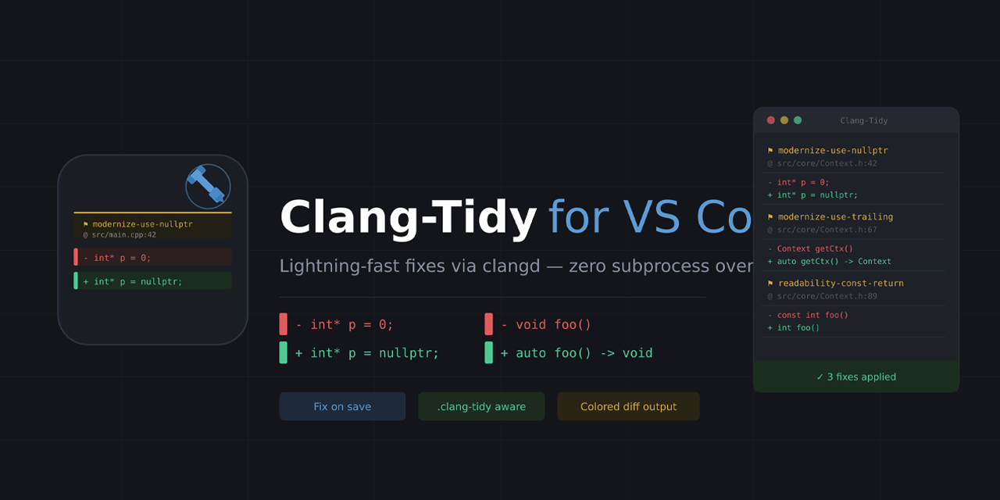

# Clang-Tidy for VS Code

Integrates **clang-tidy** into Visual Studio Code with an interactive sidebar and the ability to automatically apply fixes on file save. This extension works alongside the official [`clangd`](https://marketplace.visualstudio.com/items?itemName=llvm-vs-code-extensions.vscode-clangd) extension to elevate your C/C++ experience.

## Features

- **`.clang-tidy` Native**: Seamlessly utilizes your project's existing `.clang-tidy` configuration files to respect your specific rules and linting preferences.
- **Interactive Sidebar Panel**: Review, filter, and inspect pending Clang-Tidy fixes detected in your workspace via a dedicated view in the Activity Bar.
- **Fix on Save**: Automatically apply available Clang-Tidy quick fixes whenever you save a file.
- **Selective Fixing**: Use regex-based filters to restrict which Clang-Tidy checks should have their fixes applied.
- **File Blacklisting**: Ignore specific files or directories (like generated files or vendor libraries) from being checked/fixed.
- **Manual Commands**: Scan or apply fixes on demand via the Command Palette.

## Requirements

The extension relies on diagnostics and code actions provided by the C/C++ Language Server. It requires the `clangd` extension to be installed and active:

- [vscode-clangd](https://marketplace.visualstudio.com/items?itemName=llvm-vs-code-extensions.vscode-clangd)

## Extension Commands

This extension contributes the following commands to the Command Palette (`Ctrl+Shift+P` or `Cmd+Shift+P`):

- **`Clang-Tidy: Apply Fixes`**: Manually apply all pending Clang-Tidy quick fixes in the current file.
- **`Clang-Tidy: Scan for Fixes`**: Scan the current file or workspace for available fixes.

## Extension Settings

You can customize this extension through your VS Code settings by searching for `clang-tidy`:

| Setting                   | Type       | Default | Description                                                                                               |
| ------------------------- | ---------- | ------- | --------------------------------------------------------------------------------------------------------- |
| `clang-tidy.fixOnSave`    | `boolean`  | `false` | Automatically apply clang-tidy quick fixes on save.                                                       |
| `clang-tidy.checksFilter` | `string[]` | `[]`    | Only apply fixes from these clang-tidy checks. Supports regular expressions. Empty means apply all fixes. |
| `clang-tidy.blacklist`    | `string[]` | `[]`    | List of regular expressions. Files whose absolute paths match any entry will be skipped entirely.         |
| `clang-tidy.fixTimeoutMs` | `number`   | `3000`  | Maximum wait time in milliseconds for the `clangd` language server to return fixes.                       |

## Quick Start

1. Install this extension (which will also ensure `vscode-clangd` is installed).
2. Ensure you have `clangd` configured for your C/C++ project (e.g., providing a `compile_commands.json` file).
3. Open the **Clang-Tidy** view from the Activity Bar on the left side of your editor to review issues.
4. Enable `clang-tidy.fixOnSave` in your Settings if you want issues to be automatically fixed upon saving a file.

## Known Issues & Contributions

Found an issue or want to contribute? Please review the [CONTRIBUTING.md](CONTRIBUTING.md) and report any bugs or feature requests on our [GitHub repository](https://github.com/Schuldakt/Clang-Tidy-for-VS-Code).

## License

This project is licensed under the [MIT License](LICENSE).
